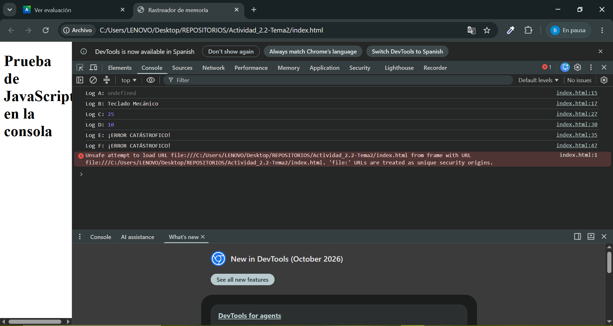

# Tarea 1: La tabla de predicciones

Completa la tabla justificando cada respuesta con base en la teoría de la unidad.

| Identificador | ¿Qué imprimirá la consola? | Justificación teórica |
| --- | --- | --- |
| Log A | `undefined` | Hoisting. |
| Log B | `Teclado Mecánico` | Hoisting. |
| Log C | `25` | Ámbito de bloque. |
| Log D | `10` | Ámbito de función. |
| Log E | ¡ERROR CATÁSTROFICO! | Ámbito de bloque. |
| Log F | ¡ERROR CATÁSTROFICO! | Zona Muerta Temporal. |

# Tarea 2

# Tarea 3

El uso de `var` permite acceder a una variable antes de su declaración debido al *hoisting*,lo que puede provocar errores difíciles de detectar. En aplicaciones extensas, la falta de control del ámbito de las variables puede afectar a la estabilidad y la mantenibilidad del proyecto.

